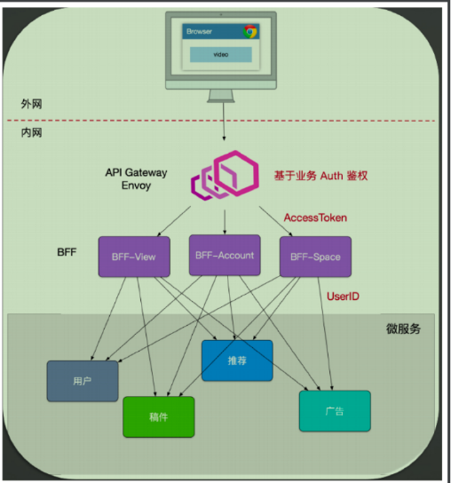

## 课程总结
### 1. Microservice的一些介绍
#### 微服务的好处
* 小即是美，由类与类沟通变成，接口和接口的沟通
* 轻量通信协议，不同语言之间能沟通。rpc 通信
* 隔离部署，之前是把巨石服务整体部署在48核，48G 的机器上，有三台。如果其中一台机器宕机，期三分之一的压力就要跑到其他两台机器。现在利用容器的就能实现CPU和内存资源隔离（linux cgroup 技术），比如在同一台机器上可以部署4核/8G，4核16G的服务，这样一来一台机器上就能部署多个容器。微服务把巨石服务拆分成很多小服务器，用docker 容器部署到更多的机器。

#### 不足之处
* 分布式事务，数据一致性
* 进程间通信变得复杂，接口之间现在变成rpc 通信。比如为了取数据不小心写了for 循环20次RPC代码，造成 很慢
* 运维基础设施，服务管理，日志可视化。已经把整体服务拆成几百个服务。测试难

#### 微服务设计
上面是粗略阐述了为什么引入微服务，实现微服务需要那些条件，微服务的优缺点。这节更近一步讲了微服务的设计架构。
* 最开始客户端是直接和各种微服务通信的，不利于版本升级，要维持很多老版本的微服务版本；而且前端要对接很多微服务团队，要做很多字段处理拼接工作，影响迭代进度。
* 就加了一层BBF（backend for foreground），即为前端服务的后端服务。随着业务复杂，一个BBF要处理的业务很多，比如账号、客户端适配、其他一些业务等，而且是单点故障single point of fail。就拆分成很多BBF，如accout BFF/app BFF/other BFF
* 但是有些横切的逻辑（如日志，路由，安全验证，限流）要在这么多BBF 上实现，更新复杂（一旦更新每一个都要更新），就向上再提取出一层Api Gateway。这是与业务无关的一层，属于基础设施

#### 微服务安全
rabc 分为认证、授权。 Api-gateWay 认证通过后，使用JWT 在header 上加上token 传给BFF，BFF验证通过后再把用户信息带给下层服务。

### 2. 错误处理
* panic 当发生了致命错误如数组越界，不可恢复的环境（需要的配置文件没提供又没有默认值），才使用painc
* sentinel error 哨兵错位类型，等值判断
* opaque error
* eliminate error 消除错误的方式，这种方式在官网学http application 的时候有类似的处理
* wrap error 遇到错误能处理就处理handle，不能处理往上抛。更详细的上下文信息，又想知道是那种错误。更优雅的错误处理

记录日志的时机
* 调试有好处，比如”谁请求了那个接口处理成功了“
* 错误一定要记录起来

#### 错误处理作业
我们在数据库操作的时候，比如 dao 层中当遇到一个 sql.ErrNoRows 的时候，是否应该 Wrap 这个 error，抛给上层。为什么，应该怎么做请写出代码？
* 作答，需要往上抛。[详见](https://github.com/lics1216/go/blob/main/work_one/main.go)

### 3. go并发学习
理解进程和线程的概念，关键字go/channel，goroutine 由go runtime 把goroutine 给线程运行，供cpu 调度。go 关键字启动线程的权限交给caller，结束权限也交给caller。在后台启动goruntine 线程之前一定要搞清楚线程（否则很容易造成goroutine 泄露）
* 什么时候停下
* 怎样主动让他停下来

goroutine 泄露，就是goroutine 没有channel 可以发送，而一直阻塞着，一直卡着。比如三个goroutine 往一个无缓存的channel中发送数据，没线程来接收channel的数据，剩下两个就卡住了。

#### 内存模型
happens before 先行发生，A操作发生在B 操作之前，如果不确定执行顺序就是说AB 并发，存在cpu 指令buffer，为了提高cpu的性能，所以程序并发执行，之间的指令执行顺序和你看到的不一样（经过了指令重排）
为了使多个线程操作串行化，引入锁的概念。

#### go.sync 包的学习
* atomic
* sync.Mutex
* channel，实际上工作中用到channel 比较少，errGroup 会更多一些，启动多个goroutine，再把他们的结果合并，利用errGroup

#### 实践练习
基于 errgroup 实现一个 http server 的启动和关闭 ，以及 linux signal 信号的注册和处理，要保证能够一个退出，全部注销退出
* [作答详见](https://github.com/lics1216/go/blob/main/work_two/main.go)

### 4.go的工程化学习
实践练习，按照自己的构想，写一个项目满足基本的目录结构和工程，代码需要包含对数据层、业务层、API 注册，以及 main 函数对于服务的注册和启动，信号处理，使用 Wire 构建依赖。可以使用自己熟悉的框架。
* [详见](https://github.com/lics1216/helloworld)

### 5. 服务器可用性设计
#### 隔离
资源隔离，查询命令和写命令隔离，建立两张表。读写分离也是资源隔离

#### 超时控制
内网rpc 请求不能超过100ms，特别请求300~500ms，外网请求秒级，别超过1s。超时的缺点
* 浪费资源，nginx 超时1s，php-fpm 10s，浏览器早就收到Nginx timeout 了，php-fpm 还在那里无脑的执行
* 导致大量强求堆积

TCP 有三个超时时间，建立连接、写、读超时时间，所以在rpc/redis/mysql 读写的时候要设置响应的超时时间。每个网络操作要设置进程内的超时时间，利用context 传递timeout，比如（客户端超时时间1s）
* redis (分配50ms)
* grpc (分配400ms)
* mysql (分配300ms)，取min(300ms，mysql配置超时时间) quota 

不能跨进程的超时传递，grpc metadata 传递超时时间，超时实现了，才能使得进程不死掉，才有可能实现下面的
* 重试
* 过载保护
* 熔断

#### 过载保护和限流
超时是为了控制这个请求的生命周期，过载保护算法起源
令牌桶算法：
漏桶算法：可以设置任意速度流入，恒定速率流出

nginx request_limit 参数就有这个样类似的算法思想，但是这些算法比较被动，要设置一个值，使得系统处理速率在这个值范围。不同系统该怎样设置呢？ 能不能有一种自适应算法，根据当前系统负载来决定是否开启限流。计算系统的负载：
* 利特尔法则，容量L=入W (速率*处理时间)
* 基于负载计算它的吞吐：qps * latency = 服务能承载的总量

实现：滑动窗口算法

#### 熔断
做好了过载保护和限流，如果客户端还是一直无脑的发请求，也可能把系统高挂。client slide thottling (熔断，客户端节流)
* 过载保护，节流是在服务端失败，熔断直接在客户端就失败。fail fast
* 开启熔断器：比如 qps 大于1000，错误率>50% 就开启熔断器，

#### 降级、重试
简单的重试，比如设定不超过三次rpc 出错，一般立刻重试，用户客户端出错。

nginx upstrean retry，一般针对读重试，写比较少重试，请求失败不一定是没写成功，可能只是网络返回失败而已
* 幂等性，只在出错方重试，它重试之后还不行就报一个全局错误码，比如503，它的上游看到503之后就知道下游已经重试了，就一路放行，都不在重试。
  否则很容易形成重复级联风暴。

一般重试逻辑写在框架里面，让框架实现

#### 实践学习
参考 Hystrix 实现一个滑动窗口计数器
* [详见](https://github.com/lics1216/go/tree/main/sliding-window)

### 6/7. 历史记录架构设计
功能在整个产品矩阵的定位，要给用户带来怎样的体验。开发别做业务的翻译机器，机械的接受上游，产品或者运营给我们的需求。
先成为业务领域的专家，了解业务的本质是为了解决什么问题。

思考一下这个架构是怎样解决缓存一致性问题的？（write-back）
1. 写来了会先把数据写到redis，redis 并发高，单个节点能处理10qps/s，布置十个节点就能处理百万qps
2. 把写请求数据聚合一下，批量写到kafka。region sharding，比如根据uid % 取余的方式把一大批用户的请求聚合在一起批量写到kafka
    * kafka 里面存储的不是完整的历史记录信息，只是存了几个关键的int 类型，redis 才是实时写入
3. history job 消费kafka 的里面的topic partition 把更新了哪些数据从redis 里面取出，再回刷到Hbase

为什么要用聚合，kafka 不擅长处理高并发读写的任务，擅长高IO吞吐，顺序写入

* 写到redis 是实时的，把请求先堆积在内存后聚合写入到 kafka（启动一个gorutine 干这事，通过channel），如果此时内存的数据丢失，那数据就没法被histroy-job 回刷到HBase
* history-job 先读kafka，再从Redis 获取完整信息写到HBASE，如果Redis cluster 挂掉，则数据也没法写回刷持久化。但是这种情况发生概率比较低，同时两个Redis 副本的replication 坏掉可能性比较低。

### 8. 分布式缓存/分布式事务
#### redis
是单线程的，qps 和memcache 两者QPS 都高，但是redis 的吞吐量没memcache 高。 所以redis 大数据value 返回的时候，Redis QPS 抖动会比较厉害，因为是单线程工作，其他进程要等待。

可能会设置 memcache + redis 缓存，但是redis 新版本提供redis 多线程改善， 如果不是value 非常大，使用redis 就可以了

#### 缓存一致性

* 把5，就是回写（发现Redis cache miss 就去DB取来回写到cache）的优先级降低，用redis 的写命令，如果cache 存在就不写了，放弃。以免把旧版本的数据覆盖新版本的数据。
* 第四部set cache，写操作set cache 可以使用 SETEX 操作
* 第5步会写缓存，Redis 可以使用setnx 操作，如果key 存在就会放弃写，不会覆盖。
* 这样就把回写操作的优先级降低了，使得缓存不会被回写操作覆盖

redis 缓存设计技巧
* 易读性的情况下，key 设置尽量小，减少资源的占用。
* 空缓存设置，对于部分数据应该设置空缓存，避免每次都把请求击穿cache 打到DB
* 读失败后的写缓存策略，降级后一般不立刻回写缓存，大量请求回写redis容易oom，可以把回写事件写到队列，如kafka。最终一致性
* 序列号使用protoBuf，尽可能减少size

#### 缓存模式：一致性hash

#### 分布式事务
单体应用，就不存在分布式事务的说法，全部服务都在一台机器上。利用mysql 本身支持的ACID操作、隔离级别，就能很好的实现事务操作。学习一下MySQL 操作的原子性，隔离级别等。

微服务里面，把单体应用都拆成了很多个服务。可能对多个服务里面的操作是要求事务性的。比如支付宝给余额宝转入10000元，余额宝要加入10000元
支付宝和余额宝部署在两个服务上。用什么方式来保证这两个操作是事务性的呢？

用异步的方式来实现分布式事务，先扣费（先减资源），再操作。
先把支付宝里面的1万元扣除，再给message 表增加一条记录“为余额宝增加10000元”。保证这两步的事务性是容易的。
启动一个服务轮询（polling publisher)，尽最大的努力（best effort）通知到余额宝的接口为余额宝增加10000元，重试多次。2s 4s 10s 60s 3min

除了轮询的方式还有，利用canal 订阅message 表binlog 日志到kakfa。

消息被消费完了，要做好标记。余额宝服务有一个账本表，每次被通知处理事件的时候到该表判断一下消息是否被处理。

#### 实践练习
1. 使用 redis benchmark 工具, 测试 10 20 50 100 200 1k 5k 字节 value 大小，redis get set 性能。
2. 写入一定量的 kv 数据, 根据数据大小 1w-50w 自己评估, 结合写入前后的 info memory 信息 , 分析上述不同 value 大小下，平均每个 key 的占用内存空间。
* [详见](https://github.com/lics1216/go/tree/main/redis-benchmark)

### 9. 网络编程
实践练习
1. 总结几种 socket 粘包的解包方式：fix length/delimiter based/length field based frame decoder。尝试举例其应用。
2. 实现一个从 socket connection 中解码出 goim 协议的解码器。
* [详见](https://github.com/lics1216/go/tree/main/network-program)

